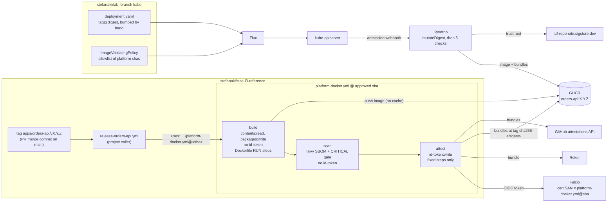

# Architecture

One repository plays three roles that would be separate teams in an organization. The point of the
setup is that each role controls one thing, and no role can do another role's job by editing files
it owns.

| Role | Lives in | Controls | Can't |
|---|---|---|---|
| **Build platform** ("org") | `.github/workflows/platform-docker.yml`, `platform-go.yml` | *How* artifacts are built, scanned and attested | Choose which commits get released |
| **Projects** | `.github/workflows/release-<app>.yml`, `apps/<app>/` | *What* is built: source, Dockerfile, tests | Sign anything, or choose where images go |
| **Verifier** | Kyverno policy in `stefanaki/lab` ([source](../policy/verify-orders-api.yaml)), [`scripts/verify.sh`](../scripts/verify.sh) | Which platform commits and source refs are trusted | Be changed by either of the above |

## Flow

The Go platform (`platform-go.yml`) has the same build → scan → attest shape, plus a `release` job
that publishes the attested binaries as a GitHub Release. Go binaries are never deployed; they are
checked with `scripts/verify.sh inventory X.Y.Z` only.

## Trust boundaries

1. **Caller → platform.** The caller pins the platform by full commit SHA:
   `uses: stefanaki/slsa-l3-reference/.github/workflows/platform-docker.yml@78c2b42… # platform/v1.0.0`.
   It passes only `app` and, for orders-api, a read-only feed token in `build-secrets`. The platform
   validates every input, fixes the registry (`ghcr.io/stefanaki/slsa-l3-reference/<app>`), and derives
   push and attest from `github.event_name` and `github.ref`, never from inputs. A caller can't attest a PR.
2. **Untrusted build steps → signing.** The Dockerfile's `RUN` steps and `go build` of repo code run
   only in the `build` job, which has no `id-token`. Only the `attest` job can get an OIDC token, and it
   has no checkout and runs no repo-defined command. It receives the subject digest from `build` and the
   SBOM from `scan` by artifact id, and checks the SBOM's sha256 before signing.
3. **Platform → verifier.** Fulcio writes the platform workflow and its commit into the certificate:
   SAN = `https://github.com/stefanaki/slsa-l3-reference/.github/workflows/platform-docker.yml@<sha>`.
   GitHub resolves that SHA, so the build can't choose it. The verifier admits only SHAs on its
   allowlist, so merging a platform change trusts nothing until the owner releases and allowlists it.
4. **Source → release.** Releases are tags `apps/<app>/vX.Y.Z`. The platform's `build` job refuses a tag
   whose commit isn't the merge commit of a PR merged into `main`. The `main` ruleset requires each
   app's `test` check, so every release was tested before merge ([`rulesets.md`](rulesets.md)).

## Jobs and permissions

The caller grants the maximum; each platform job narrows it. Top-level `permissions: {}` everywhere.

| Job | `platform-docker.yml` | `platform-go.yml` | Runs repo code |
|---|---|---|---|
| `build` | `contents: read`, `pull-requests: read`, `packages: write` | `contents: read`, `pull-requests: read` | yes |
| `scan` | `contents: read`, `packages: read` | `contents: read` | no |
| `attest` | `contents: read`, `packages: write`, `id-token: write`, `attestations: write` | `contents: read`, `id-token: write`, `attestations: write` | no |
| `release` | – | `contents: write` (tags only) | no |

All actions are pinned by SHA, and the repository requires it (`sha_pinning_required`).

## Triggers

| Caller event | Build | Push / upload | Tag | Attest |
|---|---|---|---|---|
| `pull_request` | all platforms, result discarded | no | – | no |
| push to `main` | yes | GHCR / workflow artifact | `main-<shortsha>` | yes |
| push tag `apps/<app>/vX.Y.Z` on a PR merge commit | yes | GHCR / GitHub Release | `X.Y.Z` | yes |
| anything else | fails | | | |

The `pull_request` build is a required check (`release (<app>) / build`), so a broken Dockerfile can't
merge. A failed CVE gate means the image is pushed but never attested, so admission rejects it.

## Releasing a new platform version

1. A platform change merges to `main` through a PR.
2. The owner pushes `platform/vX.Y.Z`. `platform-release.yml` checks that the commit is on `main` and
   writes the exact Kyverno attestor to the job summary.
3. The owner adds that attestor and its entry in the `approved` variable to
   `policy/verify-orders-api.yaml`, runs `kyverno test policy/tests`, and copies the policy, without
   comments, to `stefanaki/lab` (`apps/kabu/slsa-l3-reference/policies/`). Flux applies it.
4. The owner adds the SHA to `approved_platform_shas` in `scripts/verify.sh`.
5. The callers' `uses:` SHA and `# platform/vX.Y.Z` comment are bumped in a PR. `.github/renovate.json`
   is set up to open that PR, but the Renovate app isn't installed on this repository, so today the bump
   is manual.

Steps 3 and 4 are manual on purpose: automating them needs a token for the private lab repo stored in
this public repo ([`prod-delta.md`](prod-delta.md#automating-the-allowlist-pr) sketches how).

## Deploying a new app release

The kabu manifest pins `orders-api:X.Y.Z@sha256:…`. A new release is deployed by bumping that line in
`apps/kabu/slsa-l3-reference/orders-api/deployment.yaml` by hand. Kyverno's `mutateDigest` would also
pin a bare tag, but the manifest carries the digest so Git records exactly what runs.

## Known limits

- **The attested image SBOM covers `linux/amd64` only.** Trivy scans one platform per run. The CRITICAL CVE
  gate runs for every platform in the image, but the CycloneDX SBOM that `platform-docker.yml` attests
  describes `linux/amd64`. That's why `platforms` must include `linux/amd64`. BuildKit's own unsigned SBOM, inside
  the image index, covers each platform.
- **The Go SBOM is empty, and the Go CVE gate scans nothing.** The artifact upload/download (zip) round trip drops the exec bit, and
  Trivy's Go-binary analyzer skips non-executable files, so `platform/v1.0.0`'s `scan` job finds 0 components.
  The fix (`chmod +x` before Trivy) needs a new platform release.
- **Ephemeral containers aren't checked.** Kyverno generates rules for Deployments, Jobs and the other
  pod controllers only when the policy matches `pods` alone, so the `pods/ephemeralcontainers`
  subresource (`kubectl debug`) is left out. It needs RBAC only cluster admins have here.
- **Release tags are restricted to the repository admin role.** That's only the owner today, but any
  future admin could also cut a release tag.
- **Other images in the same Pod aren't checked.** The policy matches only
  `ghcr.io/stefanaki/slsa-l3-reference/*`, and a webhook `matchConditions` keeps the API server from
  calling Kyverno for Pods without such an image, so a Kyverno outage blocks only this repo's workloads.
- **First install race.** On a fresh cluster, the policy and the Deployment arrive in the same Flux
  pass. If the Deployment's Pods are admitted before the policy is ready, run
  `kubectl -n slsa-l3-reference rollout restart deploy/orders-api` once.
- **Dependency bumps are manual.** `.github/renovate.json` configures digest pins for actions, `FROM` lines,
  NuGet, Go modules and the platform self-reference, but the Renovate app isn't installed, so nothing
  opens those PRs. Base-image CVEs surface only when the CRITICAL gate fails a build.
- **Kyverno 1.19.1 runs on Kubernetes v1.36**, outside its upstream-tested range (v1.33–v1.35).
- **GHCR has no OCI referrers API.** `actions/attest` with `push-to-registry` stores bundles under the
  fallback tag `sha256-<digest>`, which is where Kyverno and `gh attestation verify --bundle-from-oci`
  find them.
